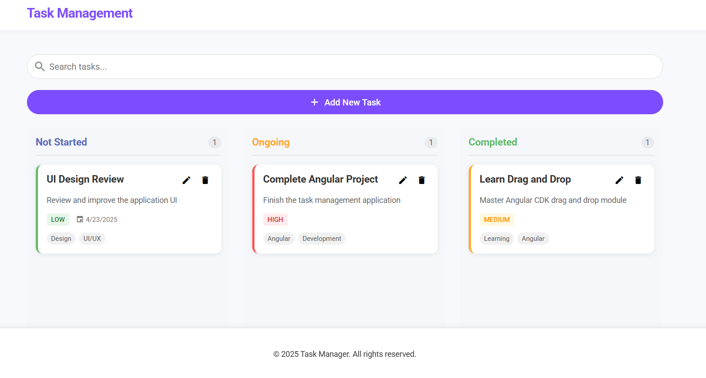
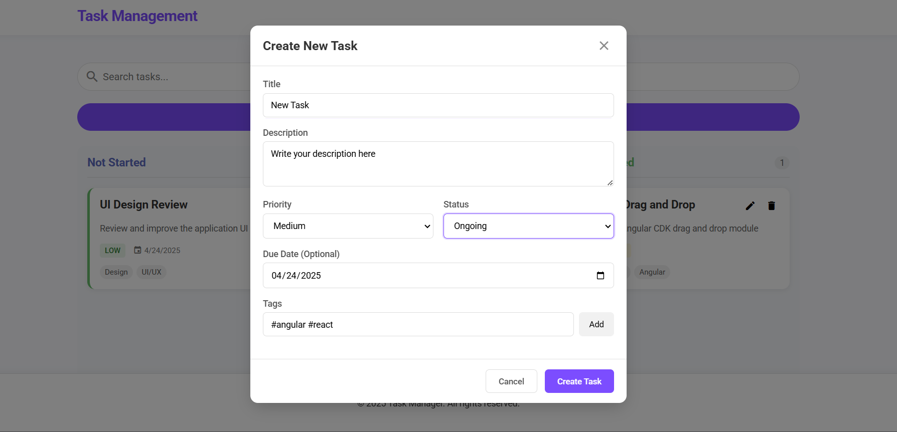
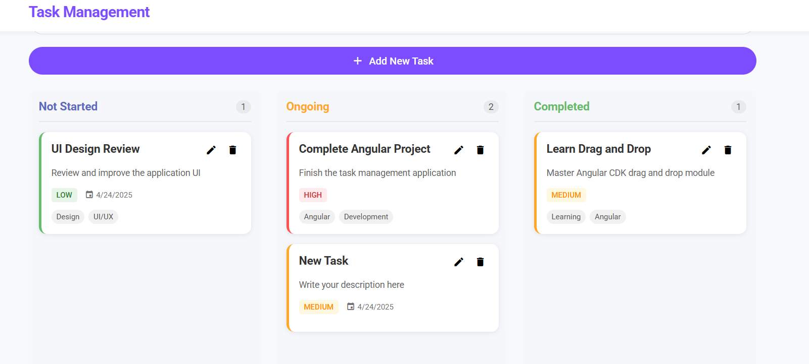
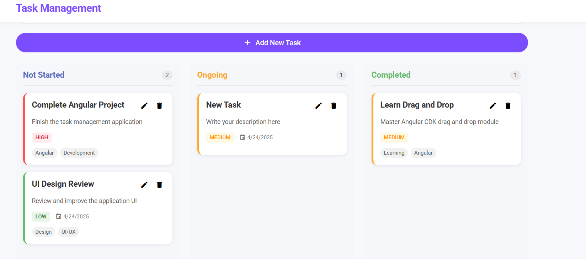
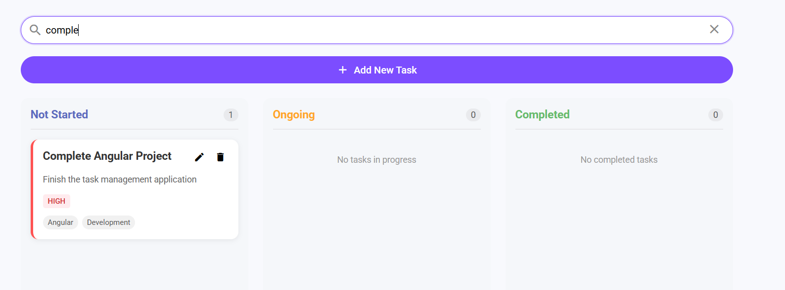

# Angular Task Management



> A slick, modern task management application with intuitive drag-and-drop functionality built with Angular.

## Features

- **Intuitive Kanban-style Board** with three status columns (Not Started, Ongoing, Completed)
- **Drag & Drop Tasks** between status columns with smooth animations
- **Priority Management** with color-coded indicators (High, Medium, Low)
- **Real-time Search** across task titles, descriptions, and tags
- **Tag System** for easy task categorization
- **Responsive Design** that works on desktop and mobile devices
- **Modern UI** with clean visuals and smooth animations

## SCREENSHOTS

1. 
2. 
3. 
4. 
5. 


##  Technology Stack

- Angular 16+
- Angular CDK (Drag & Drop)
- TypeScript
- SCSS
- RxJS for state management

## Prerequisites

- Node.js (v14+)
- npm (v6+) or yarn (v1.22+)

## Installation & Setup

1. Clone the repository:
   ```bash
   git clone https://github.com/YakubuLute/angular-kanban-task-manager
   cd angular-task-management
   ```

2. Install the dependencies:
   ```bash
   npm install
   # or
   yarn install
   ```

3. Start the development server:
   ```bash
   ng serve
   ```

4. Open your browser and navigate to:
   ```
   http://localhost:4200/
   ```

## Project Structure

```
task-management/
├── src/
│   ├── app/
│   │   ├── components/
│   │   │   ├── add-task/           # New task creation
│   │   │   ├── search-bar/         # Task searching
│   │   │   ├── task-board/         # Main board with columns
│   │   │   └── task-card/          # Individual task cards
│   │   ├── models/
│   │   │   └── task.model.ts       # Task interface definition
│   │   ├── services/
│   │   │   └── task.service.ts     # Task data management
│   │   └── app.component.*         # Root component
│   ├── environments/               # Environment configurations
│   ├── assets/                     # Static assets
│   └── styles.scss                 # Global styles
```

## Core Components

### Task Model

```typescript
export interface Task {
  id: string;
  title: string;
  description: string;
  dueDate?: Date;
  priority: 'low' | 'medium' | 'high';
  status: 'Not Started' | 'Ongoing' | 'Completed';
  tags?: string[];
  createdAt: Date;
}
```

### Task Service

Manages the application's state and provides methods for:
- Adding new tasks
- Updating existing tasks
- Deleting tasks
- Searching/filtering tasks

### Task Board Component

The main container that:

- Displays the three status columns
- Handles drag and drop between columns
- Updates task status when moved

### Task Card Component

Displays individual tasks with:

- Title and description
- Priority indicator
- Due date (if set)
- Tags
- Action buttons (edit, delete)

## Core Functionality

### Drag and Drop

Uses Angular CDK's DragDrop module to enable intuitive task movement between columns. When a task is moved, its status is automatically updated:

```typescript
drop(event: CdkDragDrop<Task[]>): void {
  if (event.previousContainer === event.container) {
    moveItemInArray(event.container.data, event.previousIndex, event.currentIndex);
  } else {
    transferArrayItem(
      event.previousContainer.data,
      event.container.data,
      event.previousIndex,
      event.currentIndex,
    );
    
    // Update task status based on the new container
    const task = event.container.data[event.currentIndex];
    const newStatus = this.getStatusFromContainerId(event.container.id);
    
    if (task.status !== newStatus) {
      const updatedTask = { ...task, status: newStatus };
      this.taskService.updateTask(updatedTask);
    }
  }
}
```

### Task Searching

Provides real-time filtering of tasks based on search queries:

```typescript
searchTasks(query: string): void {
  if (!query.trim()) {
    this.tasksSubject.next(this.tasks);
    return;
  }
  
  const filteredTasks = this.tasks.filter(task => 
    task.title.toLowerCase().includes(query.toLowerCase()) || 
    task.description.toLowerCase().includes(query.toLowerCase()) ||
    (task.tags && task.tags.some(tag => tag.toLowerCase().includes(query.toLowerCase())))
  );
  
  this.tasksSubject.next(filteredTasks);
}
```

## Responsive Design

The application is fully responsive and works on devices of all sizes:

- **Desktop:** Three columns side by side
- **Tablet:** Two columns with scrolling
- **Mobile:** Single column view with full functionality

## Future Enhancements

- [ ] User authentication and personalized task lists
- [ ] Task due date notifications
- [ ] Subtasks support
- [ ] Time tracking
- [ ] Task comments and attachments
- [ ] Dark mode
- [ ] Export/import tasks

## Contributing

Contributions are welcome! Feel free to open an issue or submit a pull request.

1. Fork the repository
2. Create your feature branch: `git checkout -b feature/amazing-feature`
3. Commit your changes: `git commit -m 'Add some amazing feature'`
4. Push to the branch: `git push origin feature/amazing-feature`
5. Open a pull request

## License

This project is licensed under the MIT License - see the [LICENSE](LICENSE) file for details.
